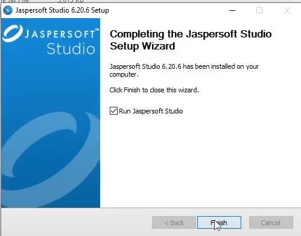

# 📘 Tugas Pertemuan 9 — Pembuatan Laporan dengan JasperReports

Proyek ini merupakan implementasi pembuatan laporan berbasis JasperReports menggunakan bahasa pemrograman Java.
Aplikasi dikembangkan di NetBeans IDE dan terkoneksi ke database PostgreSQL.

Laporan didesain menggunakan JasperSoft Studio, bukan plugin bawaan NetBeans.
Hal ini memberikan fleksibilitas lebih dalam mengatur tata letak, parameter, dan tampilan laporan.

# 🧩 Deskripsi Proyek

Aplikasi ini menampilkan data dari tabel mata_kuliah dan menyediakan fitur:

- Menampilkan data dalam JTable

- Menambahkan, mengubah, dan menghapus data (CRUD)

- Mencetak laporan data mahasiswa menggunakan JasperReports

- File laporan (.jrxml) dikompilasi menjadi .jasper, lalu ditampilkan menggunakan JasperViewer.

# 🛠️ Teknologi yang Digunakan

- Java (JDK 23)

- NetBeans IDE Versi 23

- PostgreSQL sebagai sistem basis data

- JasperReports 6.20.6

- JasperSoft Studio untuk desain report (.jrxml)

- iText 4.2.1, commons-beanutils, commons-collections, commons-digester, commons-logging

# 🧾 Catatan Penting

## Pembuatan laporan tidak menggunakan plugin bawaan NetBeans, melainkan dilakukan sepenuhnya di JasperSoft Studio.

Alur kerja laporan:

- Desain report dibuat di JasperSoft Studio → disimpan sebagai .jrxml

- File .jrxml dikompilasi → menghasilkan file .jasper

- File .jasper diimpor ke proyek NetBeans

- File .jasper dipanggil dalam kode Java menggunakan JasperFillManager dan JasperViewer

# 🧰 Langkah-Langkah Pembuatan Report

1. Mengunduh dan Menginstal JasperSoft Studio

- Buka situs resmi: https://community.jaspersoft.com/project/jaspersoft-studio

- Unduh versi JasperSoft Studio Community Edition yang sesuai dengan sistem operasi kamu.

- Ekstrak dan jalankan JasperSoft Studio (tidak perlu instalasi tambahan jika menggunakan versi portable).

2. Membuat File Report (.jrxml)

- Buka JasperSoft Studio → pilih File > New > Jasper Report

- Pilih template kosong (Blank A4)

- Tambahkan Title, Column Header, dan Detail Band

- Gunakan Text Field dan Static Text untuk menampilkan data

- Hubungkan report ke database PostgreSQL:

  - Klik kanan → Dataset and Query

  - Masukkan koneksi JDBC PostgreSQL dan query SQL-nya (misal: SELECT * FROM mata_kuliah)

- Simpan file sebagai ReportMataKuliah.jrxml

3. Meng-Compile File JRXML ke JASPER

- Klik kanan file .jrxml → pilih Compile Report

- Hasilnya akan muncul file baru dengan ekstensi .jasper

4. Mengintegrasikan ke Proyek Java (NetBeans)

- Salin file .jasper ke folder proyek, misalnya: src/pertemuan9/

- Tambahkan library berikut ke proyek:

  - jasperreports-6.20.6.jar

  - itext-4.2.1.jar

  - commons-*.jar

  - postgresql-42.5.4.jar

- Panggil report di Java menggunakan kode
  
# ▶️ Cara Menjalankan Program

1. Pastikan PostgreSQL aktif dan tabel mata_kuliah tersedia.

2. Jalankan GuiDatabase.java di NetBeans.

3. Klik tombol Tampilkan Laporan untuk melihat hasil report.

# ✍️ Penulis

Faiq

Mahasiswa Sistem Informasi

Semester 3

Universitas Islam Negeri Sunan Ampel Surabaya
